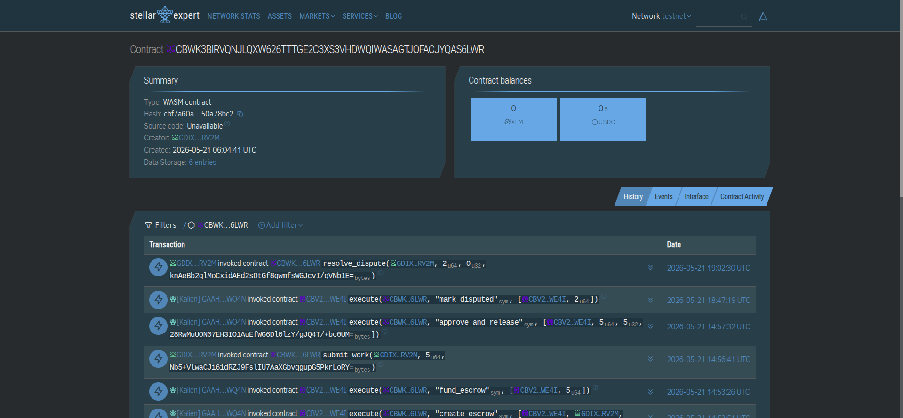
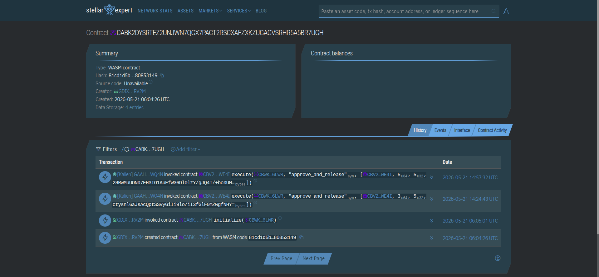
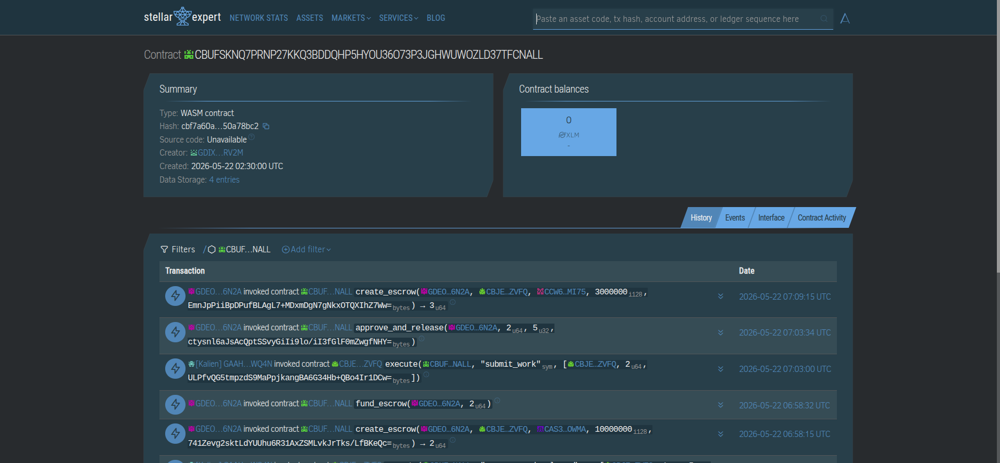

<div align="center">
  

  # Highrable

  **A Stellar-native freelance marketplace where work, escrow, and reputation are verifiable by default.**

  [Live App](https://www.highrable.work) | [Demo Assets](https://drive.google.com/drive/folders/1SNSxRG1NNy0hip1uO_nbwKSQipTo3hV4?usp=drive_link) | [Pitch Deck](https://docs.google.com/presentation/d/1DMOZLNQtI7KjeUSAGERZeUWGUAvHFVMm/edit?usp=drivesdk&ouid=104779481969901778868&rtpof=true&sd=true)

  
  
  
  
  
  
</div>

## 🧩 Problem

Freelancers and clients still depend on traditional freelance platforms that keep payments, reputation, and dispute workflows inside private systems. This creates several trust gaps:

- Clients and freelancers rely on platform promises instead of verifiable settlement rules.
- Funds can be held in opaque internal ledgers instead of transparent escrow logic.
- Reputation is usually platform-owned, editable, and difficult to verify outside one marketplace.
- Cross-border payouts can be slow, expensive, or inaccessible for global talent.
- Proof of work, cancellations, revisions, and disputes are often scattered across off-platform tools.

Highrable is built for freelancers, clients, and marketplace operators who need payment protection, transparent work history, and safer collaboration across borders.

## 🌟 Vision

Highrable aims to make remote work more trustworthy by turning freelance agreements into verifiable workflows. The long-term vision is a global marketplace where:

- Clients can fund work with transparent escrow instead of relying only on platform custody.
- Freelancers can build portable, wallet-linked proof of completed work.
- Reputation can follow the worker across future marketplaces and applications.
- Cross-border payments settle through Stellar assets with lower friction.
- Disputes and edge cases remain auditable without hiding the core payment logic.

## 🎯 Purpose

The team built Highrable to demonstrate how Stellar and Soroban can improve freelance marketplace trust. The project combines:

- Soroban smart contracts for escrow and reputation.
- Convex for fast product state, collaboration records, and admin operations.
- A Next.js web app for wallet onboarding, marketplace workflows, dashboards, profiles, disputes, and proof pages.
- Passkey smart-account support through [`kalepail/smart-account-kit`](https://github.com/kalepail/smart-account-kit), making Stellar account flows easier for users who do not want to manage seed phrases directly.

## 👥 Target Users

- **Freelancers** who want faster cross-border payouts, stronger payment assurance, and verifiable work history.
- **Clients** who want to hire with escrow-backed confidence, milestone tracking, and better trust signals.
- **Marketplace operators** who need moderation, dispute review, admin controls, and contract-backed settlement workflows.
- **Web3 builders and judges** who want to inspect a full Stellar freelance marketplace implementation rather than only a smart contract demo.

## ✨ Features

- **Escrow-backed marketplace**: Clients can post jobs, review applicants, select freelancers, create escrows, fund escrows, and release payments after submitted work is approved.
- **Soroban escrow contract**: The escrow contract supports direct escrow creation, open escrow creation, create-and-fund flows, funding, freelancer assignment, proof submission, release, cancellation, dispute marking, dispute resolution, and asset allowlisting.
- **On-chain reputation contract**: Approved escrow releases can record immutable completion data, including escrow id, client, freelancer, asset, amount, job hash, rating, review hash, and freelancer aggregate stats.
- **Passkey smart accounts**: Highrable integrates [`kalepail/smart-account-kit`](https://github.com/kalepail/smart-account-kit) for Stellar/Soroban smart-account wallet flows secured by WebAuthn passkeys, including creation, restoration, contract discovery, and smart-account mediated escrow actions.
- **Stellar wallet authentication**: The app includes Stellar challenge/verify auth, wallet persistence, wallet session handling, and route guards for wallet-required flows.
- **Stablecoin and asset support**: Highrable supports USDC-style Stellar asset configuration, Stellar Asset Contract usage, trustline readiness, stablecoin balance panels, optional XLM escrow support, and XLM-to-USDC top-up flows.
- **Stellar Path Payments**: Highrable uses Stellar path payments so users can top up or convert from XLM into the configured USDC-style escrow asset before funding work, reducing friction for users who hold XLM but need stablecoin liquidity for marketplace payments.
- **Marketplace safety tools**: Listings can be sorted by safety, filtered by funded status, checked for scam signals, reported by users, and shown with trust/safety warnings before freelancers apply.
- **Applications and milestone projects**: Freelancers can submit proposals, showcase previous verified work, and apply to micro-gig or milestone-based jobs.
- **Dashboards**: Freelancer and client dashboard modes summarize income, pending balances, recent payouts, applied jobs, ongoing jobs, posted jobs, and deadline notifications.
- **Public profiles**: Freelancer profiles show wallet-linked identity and reputation. Client trust profiles show reliability indicators, recent jobs, completed payments, funded escrows, and reported jobs.
- **Work agreements and submissions**: Work agreements, agreement versions, work submissions, proof hashes, revision requests, deadline reminders, and notifications support the delivery lifecycle.
- **Attachments and chat**: Protected attachments, access logs, conversations, messages, read tracking, and evidence records keep collaboration inside the platform.
- **Disputes and cancellations**: Users can request cancellations, open disputes, attach evidence, respond in dispute threads, retry on-chain dispute marking, and inspect dispute timelines.
- **Admin operations**: Admin wallets can access metrics, dispute queues, dispute detail pages, moderation notes, status updates, and settlement recording APIs.
- **Public proof pages**: Escrow proof pages expose completed work details, proof status, reputation context, timeline entries, and share actions.

## 🛠️ Tech Stack

- **Frontend**: Next.js 16, React 19, TypeScript, App Router, Framer Motion.
- **UI**: Shared `@repo/ui` package, lucide-react, Heroicons, reusable Highrable components.
- **Backend**: Convex 1.38, generated typed API, shared `@repo/convex-client`.
- **Blockchain**: Stellar, Soroban, Stellar RPC, Horizon, `@stellar/stellar-sdk`.
- **Wallets**: Stellar Wallets Kit, Stellar wallet challenge/verify auth, [`smart-account-kit`](https://github.com/kalepail/smart-account-kit), WebAuthn passkeys.
- **Smart contracts**: Rust, `soroban-sdk`, Stellar CLI.
- **Monorepo tooling**: pnpm workspaces, Turborepo, TypeScript 5.9, oxlint, oxfmt, Husky.

## 🚀 How to Run Locally

Prerequisites:

- Node.js `>=20.9.0`
- pnpm `11.1.2`
- Rust toolchain
- Stellar CLI
- Convex account/project
- Stellar testnet wallet for escrow testing

Install dependencies:

```bash
pnpm install
```

Create local environment files:

```bash
cp apps/web/.env.example apps/web/.env.local
cp packages/backend/.env.example packages/backend/.env.local
```

Configure the required values in the copied env files:

- `NEXT_PUBLIC_CONVEX_URL`
- `NEXT_PUBLIC_STELLAR_NETWORK`
- `NEXT_PUBLIC_STELLAR_NETWORK_PASSPHRASE`
- `NEXT_PUBLIC_STELLAR_RPC_URL`
- `NEXT_PUBLIC_STELLAR_HORIZON_URL`
- `NEXT_PUBLIC_ESCROW_CONTRACT_ID`
- `NEXT_PUBLIC_REPUTATION_CONTRACT_ID`
- `NEXT_PUBLIC_STABLECOIN_TOKEN_CONTRACT_ID`
- `NEXT_PUBLIC_APP_DOMAIN`
- `HIGHRABLE_ADMIN_WALLET_ADDRESS`
- `HIGHRABLE_ADMIN_CONVEX_SECRET`

Run the full monorepo development workflow:

```bash
pnpm dev
```

Or run the backend and frontend separately:

```bash
cd packages/backend
pnpm dev
```

```bash
cd apps/web
pnpm dev
```

The web app runs on `http://localhost:3000`.

Useful commands:

```bash
pnpm build
pnpm lint:fix
pnpm contracts:build
cd contracts && cargo test
```

## 🌐 Deployment

### Testnet

- **Network**: Stellar Testnet
- **Escrow Contract**: `CACS2JKVBWMYZOZKMKJSNFURCDICQTPST5QDUDQ43VZLI7XGLKRUSPLJ`
- **Reputation Contract**: `CB65DCTGJA6SMGWRHYOOWLOPVSY5BMRUGIFXWF4QJFQIKZCHSWSX2SE2`
- **Deployment Artifact**: `deployments/testnet.json`

Deploy contracts to testnet:

```bash
DEPLOYER=<stellar_identity> \
PLATFORM_ADMIN=<stellar_public_key> \
pnpm contracts:deploy:testnet
```

Verify testnet deployment:

```bash
DEPLOYER=<stellar_identity> pnpm contracts:verify:testnet
```

📸 Screenshot - Stellar Expert Testnet:

| Escrow contract | Reputation contract |
| --- | --- |
|  |  |

### Mainnet

- **Network**: Stellar Mainnet
- **Escrow Contract**: `CBUFSKNQ7PRNP27KKQ3BDDQHP5HYOU36O73P3JGHWUWOZLD37TFCNALL`
- **Reputation Contract**: `CBHF3FE2EVSU6MAPJIR3PQES3QKOUXMWYERNYTC4YOU2E6G3INAE22VQ`
- **Deployment Artifact**: `deployments/mainnet.json`

Deploy contracts to mainnet:

```bash
MAINNET_DEPLOY_CONFIRM=deploy-highrable-mainnet \
DEPLOYER=<stellar_cli_identity> \
PLATFORM_ADMIN=<G...> \
STELLAR_RPC_URL=<https_mainnet_rpc_url> \
pnpm contracts:deploy:mainnet
```

Before production deployment, review:

- [Mainnet smart-account readiness](docs/mainnet-smart-account-readiness.md)
- [Deployment notes](docs/deployments.md)
- [Stablecoin payments](docs/stablecoin-payments.md)
- [Passkey smart-account implementation](docs/passkey-smart-account-implementation.md)

📸 Screenshot - Stellar Expert Mainnet:

| Escrow contract | Reputation contract |
| --- | --- |
|  |  |

## 🎥 Demo

- 🔗 **Live App**: [https://www.highrable.work](https://www.highrable.work)
- 🎬 **Demo Assets / Video**: [Google Drive](https://drive.google.com/drive/folders/1SNSxRG1NNy0hip1uO_nbwKSQipTo3hV4?usp=drive_link)
- 🖼️ **Pitch Deck**: [Google Slides](https://docs.google.com/presentation/d/1DMOZLNQtI7KjeUSAGERZeUWGUAvHFVMm/edit?usp=drivesdk&ouid=104779481969901778868&rtpof=true&sd=true)
- 📄 **Implementation Inventory**: [docs/highrable-implementation-inventory.md](docs/highrable-implementation-inventory.md)
- 🧾 **Mainnet Readiness Notes**: [docs/mainnet-smart-account-readiness.md](docs/mainnet-smart-account-readiness.md)

## 👩‍💻 Team

| Name | Role | GitHub |
| --- | --- | --- |
| Bette Anjanelle Cabarles | Frontend Developer | [@anjobette](https://github.com/anjobette) |
| Carl Aldrey Bergado | Smart Contract and Fullstack Developer | [@Carts1024](https://github.com/Carts1024) |
| Christelle Anne Dacapias | Social Media Manager | [@chrissstellee](https://github.com/chrissstellee) |
| Crystalyn Danga | Business Analyst, Researcher, Project Manager | [@tal_zz](https://github.com/tal_zz) |
| Sherwin Limosnero | Public Relations, Pitcher | [@owenlim225](https://github.com/owenlim225) |

## 📜 License

MIT
