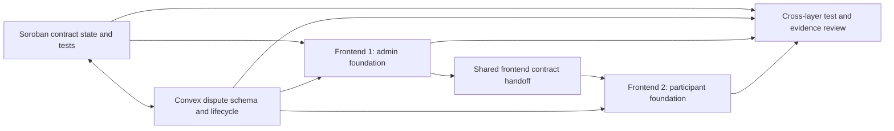

# Highrable Instawards Deliverable 1 — Three-Day Week 1 Sprint Plan

## 1. Purpose and naming clarification

This plan treats **Deliverable 1** as the requested **Week 1 three-day foundation deliverable**. It is not the same label as “Deliverable 1: Soroban Dispute Contract Feature” in Section 4 of the SOW. This Week 1 deliverable contributes foundation work to all four role-specific deliverables and prepares the team for the remaining 30-day implementation.

The plan is based on [`Highrable-Instawards-SOW.md`](./Highrable-Instawards-SOW.md), especially:

- Week 1’s four-role foundation scope and expected output.
- The dispute lifecycle, authorization, settlement, and evidence requirements.
- The four role-specific branches and attributable pull requests.
- The final testing and Stellar Testnet targets that this three-day slice must prepare for.

The repository already contains substantial dispute functionality in Soroban, Convex, and the web application. Therefore, this plan is **baseline-aware**: existing behavior must be verified first, and a task that already exists must produce focused regression coverage, hardening, or an integration improvement rather than duplicate code.

## 2. Three-day outcome

At the end of the three days, the team will have:

1. **24 substantive code or test commits**, six attributable commits per developer.
2. Four active role-specific branches:
   - `instawards/dispute-contract`
   - `instawards/dispute-backend`
   - `instawards/dispute-admin-ui`
   - `instawards/dispute-participant-ui`
3. Four draft pull requests with preserved commit history.
4. Soroban dispute state, authorization, settlement, and test foundations aligned with the SOW.
5. Convex dispute/event schema, participant/admin authorization, lifecycle bookkeeping, and test foundations aligned with the SOW.
6. A protected administrator queue/detail foundation owned by Frontend Developer 1.
7. A participant dispute route/form foundation owned by Frontend Developer 2 after the Frontend Developer 1 handoff.
8. Initial automated tests at every affected layer, with the full SOW target of at least 20 passing tests remaining the 30-day acceptance target.
9. A handoff and evidence package containing branch links, commit mapping, test output, interface decisions, and known gaps.

This plan does not include production deployment, real-fund settlement, or a production Testnet demonstration. Those remain later SOW work and must use the existing deployment and wallet safety boundaries.

## 3. Commit accounting policy

The target is **24 code/test commits**, within the requested 20–30 range.

| Rule | Application |
| --- | --- |
| One sub-sprint equals one commit | Every `C01`–`C24` row below represents one substantive commit. |
| Documentation is excluded | Sprint plans, interface notes, vault updates, PR descriptions, screenshots, and evidence indexes do not count toward 24. |
| No artificial churn | If a listed behavior is already complete, replace implementation work with meaningful regression tests, authorization hardening, failure-path handling, or integration coverage in the same layer. |
| Preserve attribution | Each developer commits only to the assigned role branch and opens one attributable draft PR. |
| Keep commits reviewable | A commit should change one coherent behavior or test boundary and leave its owned package buildable/testable. |
| Do not squash before evidence capture | If the final merge workflow squashes commits, capture the original branch history and commit-to-sub-sprint mapping first. |

The SOW labels Week 1 as 50 hours, while its role allocations total 45 hours (13 Soroban + 12 Convex + 10 Frontend 1 + 10 Frontend 2). This plan preserves the role allocations and reserves the remaining 5 hours as shared integration, review, and handoff time.

## 4. Team ownership and dependency boundaries

| Developer | Week 1 role | Branch | Primary ownership |
| --- | --- | --- | --- |
| Soroban Smart Contract Developer | Contract state, authorization, settlement, Rust tests | `instawards/dispute-contract` | `contracts/escrow/src/lib.rs`, `contracts/escrow/src/test.rs`, contract build/test compatibility |
| Convex Backend Developer | Dispute records, lifecycle mutations, admin bookkeeping, backend tests | `instawards/dispute-backend` | `packages/backend/convex/disputes/`, `packages/backend/convex/admin/`, related schema and helper paths |
| Frontend Developer 1 | Administrator review and resolution interface | `instawards/dispute-admin-ui` | `apps/web/app/admin/disputes/`, `apps/web/features/admin/`, agreed shared review primitives |
| Frontend Developer 2 | Participant dispute interface | `instawards/dispute-participant-ui` | `apps/web/app/disputes/`, `apps/web/features/disputes/`, participant-facing tests |

### Frontend sequencing rule

Frontend Developer 1 starts first. Frontend Developer 2 starts code work only after Frontend Developer 1 completes `C06` and publishes the shared interface handoff. This avoids both frontend developers modifying the same route, feature, or shared component files at the same time.

The handoff must freeze:

- Dispute status and on-chain status names.
- Admin/participant view-model shapes.
- Loading, unauthorized, failed, retryable, and resolved UI states.
- Shared component ownership and file ownership.
- Convex function names and argument contracts consumed by the UI.

After the handoff, Frontend Developer 2 consumes the frozen contracts and does not edit Frontend Developer 1’s administrator files. Shared-contract changes require a short coordination review and an explicitly assigned owner.

### Architecture boundaries to preserve

- Convex owns dispute workflow records, evidence relationships, audit events, notifications, and local transaction phases.
- Soroban remains authoritative for escrow status, escrow funds, authorization, and on-chain settlement.
- Direct contract calls remain in `apps/web/core/stellar` and use the existing simulation/execution helpers.
- Administrator routes use the signed-session, configured-admin-wallet, and Convex-secret boundary; a browser role flag is not sufficient authorization.
- Participant access checks remain in trusted Convex helpers; UI guards are not the only protection.
- Generated Convex files are outputs and must not be hand-edited.
- A passkey smart-account address must not be used as a classic Stellar source account where RPC simulation requires a classic account.

## 5. Execution flow



Soroban and Convex work in parallel because they have separate primary workspaces. Frontend work is deliberately staged: administrator foundations first, participant work second, then cross-layer verification.

## 6. Sprint 1 — Day 1: contract, backend, and administrator foundations

**Goal:** establish the authoritative dispute boundaries and complete the first administrator-facing foundation before the participant frontend begins.

| Sub-sprint / commit | Developer | Code/test commit scope | Done when |
| --- | --- | --- | --- |
| **C01** | Soroban | Add or align Rust dispute lifecycle fixtures and typed state/error assertions for `Funded`/`Submitted → Disputed`. | Fixtures cover the valid entry states and identify the contract errors used by invalid transitions. Existing tests are extended rather than duplicated. |
| **C02** | Convex | Lock the dispute schema/event validator and index contract against the SOW lifecycle, actor roles, and on-chain phases; add the backend test fixture foundation. | `disputes` and `disputeEvents` represent the required fields and statuses, and a test can create a valid participant/admin fixture without bypassing domain helpers. |
| **C03** | Frontend 1 | Add or harden the administrator route shell and runtime role gate for `/admin/disputes` and `/admin/disputes/[disputeId]`. | Protected, unauthorized, loading, and not-found states are explicit and use the existing admin authentication boundary. |
| **C04** | Soroban | Harden `mark_disputed` authorization and status guards; add negative tests for unrelated callers and `Created`, `Released`, `Cancelled`, and already-`Disputed` escrows. | The contract accepts only the client, assigned freelancer, or configured platform admin and rejects invalid statuses. |
| **C05** | Convex | Align participant/admin authorization helpers and dispute-creation invariants with the escrow, job, milestone, and participant relationships. | A case cannot be created for an ineligible or unrelated wallet, and the mutation path records the actor role through trusted backend logic. |
| **C06** | Frontend 1 | Build the administrator queue/detail scaffold and freeze the shared dispute view-model, status, and error-state boundary for handoff. | Queue/detail loading, empty, error, and protected states render; Frontend Developer 2 receives the file ownership map and frozen UI contract. |

**Day 1 exit gate:** `C01`–`C06` are pushed, the four branches and four draft PRs exist, and Frontend Developer 1 has completed the participant-facing handoff. Frontend Developer 2 may begin code work only after this gate.

## 7. Sprint 2 — Day 2 morning: core workflow foundations and participant start

**Goal:** connect the SOW’s contract signatures, dispute creation path, administrator data surface, and participant route shell.

| Sub-sprint / commit | Developer | Code/test commit scope | Done when |
| --- | --- | --- | --- |
| **C07** | Frontend 2 | Add the participant route shell for `/disputes` and `/disputes/[disputeId]` using the frozen handoff contract. | Participant list/detail routes have wallet-scoped loading, unauthorized, empty, error, and not-found states without modifying Frontend Developer 1’s files. |
| **C08** | Soroban | Align the `resolve_dispute` interface and basis-point validation fixtures for the configured admin and `Disputed` escrow state. | Tests cover `0`, `10_000`, a valid partial share, values above `10_000`, unauthorized admin, and wrong escrow status. |
| **C09** | Convex | Implement or harden the dispute creation path and initial audit event, including related escrow/submission/evidence validation. | A valid case enters `open`, records the correct participants and parent links, and creates an auditable opening event. |
| **C10** | Frontend 1 | Wire the administrator queue/detail data surface and review-status controls to the Convex/admin contracts. | The admin UI renders the backend status values without inventing a second state machine and blocks controls outside the permitted review flow. |
| **C11** | Frontend 2 | Implement participant dispute-form validation and create-dispute integration. | Title, reason, description, eligible escrow, and related-record inputs are validated; pending, failure, and retryable submission states are visible. |
| **C12** | Soroban | Add settlement transfer invariant tests for full client refund, full freelancer payout, and a valid split outcome. | Tests prove the escrow balance reaches zero, the terminal contract status is correct, and freelancer/client amounts sum to the original escrow amount. |

## 8. Sprint 3 — Day 2 afternoon: chain phases, resolution controls, and evidence surfaces

**Goal:** make the application-side phases and both frontend surfaces ready for the failure and evidence paths required by the SOW.

| Sub-sprint / commit | Developer | Code/test commit scope | Done when |
| --- | --- | --- | --- |
| **C13** | Convex | Add or harden idempotent `mark_disputed` phase mutations for started, succeeded, failed, and retryable outcomes. | `not_marked → marking → marked` and `mark_failed → retry` transitions preserve transaction hashes, actor data, and audit events without duplicate case creation. |
| **C14** | Frontend 1 | Add administrator resolution controls with basis-point validation and review-state guards. | Client, freelancer, and split choices map to valid basis points; invalid input, unauthorized access, and unavailable on-chain states cannot submit. |
| **C15** | Frontend 2 | Wire participant list/detail data and the dispute timeline to Convex queries and event records. | Participants see only permitted cases, actor roles and state changes are readable, and the timeline handles loading, empty, and error states. |
| **C16** | Soroban | Implement the approved dispute event foundation from the C01/C02 contract-backend interface decision and add Rust assertions for the event payload. | Event topics/fields are explicitly agreed with the backend before coding, no public method is changed unnecessarily, and tests cover mark/resolve payload integrity. |
| **C17** | Convex | Align administrator resolution-phase records for started, succeeded, and failed settlement attempts. | Admin-only mutations validate status and basis points, store transaction/error details, and map successful settlement to the correct Convex terminal status. |
| **C18** | Frontend 1 | Connect administrator Soroban execution, simulation-before-submit, failure/retry handling, and settlement confirmation. | The UI distinguishes simulation, submission, confirmation, and Convex-recording failures and does not blindly resubmit a known transaction hash. |

**Day 2 exit gate:** both frontend feature slices render against the frozen contracts; chain and Convex phase names agree; failure and retry behavior is represented in code; and all four developers have contributed substantive commits.

## 9. Sprint 4 — Day 3: hardening, tests, and evidence readiness

**Goal:** close the Week 1 foundation with cross-layer regression coverage and reviewer-ready commit evidence.

| Sub-sprint / commit | Developer | Code/test commit scope | Done when |
| --- | --- | --- | --- |
| **C19** | Frontend 2 | Add participant evidence and response components with attachment ownership/access checks. | Participants can add permitted evidence/responses, protected attachment reads use backend authorization, and invalid/unauthorized actions show recoverable errors. |
| **C20** | Soroban | Add regression tests proving disputed escrows cannot be submitted, released, cancelled, or disputed again, and terminal outcomes cannot be re-entered. | The dispute state machine is covered at the entry, settlement, and terminal boundaries without changing unrelated escrow behavior. |
| **C21** | Convex | Add retry/reconciliation coverage and parent escrow/job/milestone patch assertions for marking and settlement outcomes. | Failed operations can be retried safely, successful operations update the local mirror consistently, and repeated callbacks remain idempotent. |
| **C22** | Frontend 1 | Add administrator queue/detail/resolution tests for protection, empty/error states, basis-point validation, failure, retry, and confirmation. | The administrator foundation has focused tests that can run through the web test command and cover the SOW’s protected review path. |
| **C23** | Frontend 2 | Add participant loading/error/retry and transaction-link states, including `marked`, `mark_failed`, and Stellar Expert link behavior. | A participant can understand pending, failed, retryable, and confirmed states without a page reset or misleading success message. |
| **C24** | Frontend 2 | Add participant integration/accessibility regression tests and complete the frontend handoff verification. | Participant forms, timeline, evidence, and response paths have keyboard/label/error coverage; the participant PR contains its six mapped commits. |

## 10. Developer commit distribution

| Developer | Commits | IDs | Planned role evidence |
| --- | ---: | --- | --- |
| Soroban Smart Contract Developer | 6 | `C01`, `C04`, `C08`, `C12`, `C16`, `C20` | Rust source/tests, contract state and authorization coverage, settlement invariants, event decision/coverage, build/test output |
| Convex Backend Developer | 6 | `C02`, `C05`, `C09`, `C13`, `C17`, `C21` | Schema/helper/mutation changes, authorization and idempotency coverage, lifecycle and reconciliation test output |
| Frontend Developer 1 | 6 | `C03`, `C06`, `C10`, `C14`, `C18`, `C22` | Protected admin routes, queue/detail UI, resolution controls, chain failure handling, admin tests |
| Frontend Developer 2 | 6 | `C07`, `C11`, `C15`, `C19`, `C23`, `C24` | Participant routes, form/list/detail UI, evidence/responses, retry/transaction states, participant tests |
| **Total** | **24** | `C01`–`C24` | **20–30 requested code/test commits satisfied** |

## 11. Validation and evidence gates

### Per-commit checks

- Soroban commits run the focused Rust contract tests; contract changes preserve authorization, status, transfer, and error behavior.
- Convex commits validate arguments, participant/admin authorization, state transitions, audit events, and idempotency.
- Frontend commits run focused Vitest coverage where available and preserve existing wallet, Convex, and route boundaries.
- Any direct chain path continues to simulate before submission and records transaction phases separately from local UI state.

### Day 3 validation

Run only the repository commands relevant to the changed layers:

```bash
cd contracts && cargo test
pnpm --filter web test
pnpm --filter web build
pnpm --filter web lint:fix
pnpm --filter @repo/backend lint:fix
```

The full SOW acceptance target remains:

- At least 5 Soroban contract tests.
- At least 8 Convex backend tests.
- At least 4 participant-interface tests.
- At least 3 administrator-interface/end-to-end tests.
- At least 20 passing automated tests with zero required failures.

Week 1 must leave the test harnesses and initial cases in place; it does not claim that the full 30-day test target or five Testnet lifecycles are complete.

### Evidence to collect

The Week 1 evidence package should include:

1. Four branch URLs and the `C01`–`C24` commit mapping.
2. Four draft PR URLs showing individual attribution and scope.
3. Focused test output and the command used for each layer.
4. The frozen frontend handoff contract and file ownership map.
5. A state-transition and authorization decision record.
6. A short known-gaps list, including any SOW requirement deferred to Weeks 2–4.
7. Screenshots or a short recording of the protected admin shell and participant shell, if available.

Documentation and evidence updates are required for reviewer clarity but are **not** counted as commits in the 24-commit target.

## 12. Week 1 exit criteria

The three-day deliverable is complete when all of the following are true:

- [ ] `C01`–`C24` are substantive code/test commits distributed six per developer.
- [ ] All four role-specific branches exist and contain attributable work.
- [ ] Four draft PRs are open with preserved history.
- [ ] Frontend Developer 1’s shared contract and file handoff is complete before Frontend Developer 2’s code start.
- [ ] Soroban dispute state, authorization, basis-point, transfer, and terminal-state foundations are tested.
- [ ] Convex dispute records, event records, participant/admin authorization, on-chain phase bookkeeping, and retry/reconciliation foundations are tested.
- [ ] Protected administrator and participant route foundations handle loading, unauthorized, empty, error, retryable, and resolved states.
- [ ] No frontend developer has created a competing dispute state machine or edited the other developer’s owned surface without coordination.
- [ ] No generated Convex output, secret, private key, seed phrase, or sensitive environment value is committed.
- [ ] The final test output and known gaps are attached to the four PRs/evidence package.

## 13. Deferred after this three-day deliverable

The following remain later SOW work and must not be misrepresented as Week 1 completion:

- Full four-week implementation and merge of the dispute feature.
- Final 20-test minimum if Week 1 has only established the initial test cases.
- Five complete Stellar Testnet dispute lifecycles covering client refund, freelancer payout, and split settlement.
- Testnet deployment identifier and at least five Stellar Expert transaction links.
- Reviewer deployment, final screenshots, technical reports, and demo video.
- Production settlement, real user funds, third-party audit, automated evidence judgment, new wallet/payment-gateway features, mobile, and multi-chain work.

## 14. Known decisions and risks

1. **Existing implementation baseline:** Current source already contains dispute contract methods, Convex dispute functions, participant routes, and administrator routes. The team must record the baseline before coding and turn completed items into regression/hardening commits instead of duplicating them.
2. **Soroban events:** The current contract documentation indicates that explicit Soroban events are not yet emitted, while the SOW requires resolution events. `C16` is blocked on an explicit contract/backend payload decision; no event topic or payload should be invented silently.
3. **Authorization boundary:** Several public Convex flows still use caller-supplied wallet values as a known limitation. Week 1 must preserve trusted backend participant/admin checks and must not describe browser guards as signed authentication.
4. **Three-day compression:** The 50-hour SOW label and 45 hours of listed role allocations require a shared five-hour integration/review buffer. If time is lost, preserve the contract/backend authorization and frontend handoff gates before polishing UI.
5. **Commit-count pressure:** The 24-commit target is a delivery-accounting target, not permission to add meaningless changes. If a layer has no remaining substantive Week 1 work, the team should report the shortfall rather than manufacture commits.
