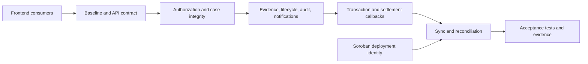

# Highrable Instawards Deliverable 2 — Four-Day Backend Sprint Plan

## 1. Purpose and naming clarification

This plan centers on **Deliverable 2: Convex Dispute Backend** in Section 4.1 of the SOW and schedules four days of coordinated work for the full four-person engineering team. The Convex backend remains the primary deliverable; the Soroban and two frontend developers implement the contract and UI integration slices needed to exercise it. It is not the same as the SOW's Week 2 label, and it does not claim completion of the full contract, participant-interface, administrator-interface, or project-wide deliverables.

The plan follows the structure of the [Deliverable 1 sprint plan](./Highrable-Instawards-Deliverable-1-Sprint-Plan.md) and is based on:

- The Deliverable 2 scope and Week 2–4 backend work in the [Instawards SOW](./Highrable-Instawards-SOW.md).
- The current dispute implementation and backend evidence recorded in [Disputes and Cancellations](../obsidian/modules/Disputes%20and%20Cancellations.md).
- The current authorization, Convex, state-machine, and sync boundaries documented in the repository knowledge vault.

This sprint is **baseline-aware**. The repository already has dispute/event records, creation and evidence validation, participant/admin role checks, chain-marking callbacks, settlement attempts, notifications, and reconciliation bookkeeping. Work already present must be validated against the acceptance matrix and strengthened at a real uncovered boundary; it must not be re-created as duplicate code or duplicate tests.

## 2. Four-day outcome

At the end of the sprint, the team will have:

1. **24 substantive code or test commits**, six planned per developer across the four roles, within the requested 20–30 range.
2. Four role-specific branches with preserved commit attribution and substantive pull requests: `instawards/dispute-contract`, `instawards/dispute-backend`, `instawards/dispute-admin-ui`, and `instawards/dispute-participant-ui`.
3. A backend acceptance matrix mapping the SOW to source functions, authorization checks, state transitions, and tests.
4. Verified Convex handling for participant and administrator access, evidence association, case lifecycle, audit events, notifications, and bounded reads.
5. Contract and frontend integration slices aligned with the Convex status, callback, resolution, and error contracts.
6. Regression coverage for marking, settlement, retries, reconciliation, transaction records, and linked escrow/job/milestone updates.
7. Focused contract, backend, and frontend test/lint reports, API/state-transition notes, and a known-gaps list suitable for cross-layer review.
8. A Testnet verification record for the selected network and contract scope, if the matching contract deployment and credentials are available. Local tests alone will not be presented as live-chain evidence.

The SOW's backend minimum is at least eight passing Convex tests. Existing repository notes already report substantially more backend tests; the sprint records the actual current result and adds only distinct coverage that closes an identified gap. The separate SOW target of at least 20 tests across all layers and five complete Testnet lifecycles remains a project-wide acceptance target.

## 3. Commit accounting policy

The target is **24 substantive code/test commits**.

| Rule | Application |
| --- | --- |
| One row equals one planned commit | `C01`–`C24` each describe a coherent source or test change. |
| Documentation is excluded | API/state notes, this plan, PR descriptions, test reports, and evidence indexes do not count toward 24. |
| No duplicate work | Existing behavior is inspected first. A completed row becomes a missing edge-case, regression, authorization, or integration test in the same scope only when that test adds distinct evidence. |
| No artificial churn | Commits remain independently reviewable and meaningful. If the baseline already satisfies the full row and no real gap exists, record that fact instead of splitting or manufacturing changes. The 20–30 target is not permission to add meaningless commits. |
| Preserve attribution | Each developer commits to their assigned role branch; retain the C-ID mapping in the four branch/PR evidence records. |
| Keep changes in scope | Generated Convex files are outputs. Do not hand-edit them or include unrelated workspace changes. |

## 4. Ownership and dependency boundaries

| Developer | Branch | Primary ownership in this sprint |
| --- | --- | --- |
| Convex Backend Developer | `instawards/dispute-backend` | `packages/backend/convex/disputes/`, `packages/backend/convex/admin/`, related schema/helpers, `packages/backend/tests/`, and backend API/state documentation |
| Soroban Smart Contract Developer | `instawards/dispute-contract` | `contracts/escrow/`, contract tests, agreed method/event semantics, and Testnet deployment identity |
| Frontend Developer 1 — Administrator UI | `instawards/dispute-admin-ui` | `apps/web/app/admin/disputes/`, `apps/web/features/admin/`, and administrator integration/tests |
| Frontend Developer 2 — Participant UI | `instawards/dispute-participant-ui` | `apps/web/app/disputes/`, `apps/web/features/disputes/`, and participant integration/tests |

### Backend integration contract

- Convex owns the application dispute record, evidence relationships, workflow events, notifications, transaction bookkeeping, and local reconciliation results.
- Soroban remains authoritative for escrow state, escrow funds, and the settlement outcome.
- The backend records a chain result only through the existing verified callback/recovery boundary or an explicitly scoped RPC read. It must not infer settlement from a browser success message.
- Existing participant wallet-argument checks are not proof of private-key possession. The sprint must preserve participant/role and parent-record checks, and must describe this known limitation accurately. Administrator actions continue to require the signed-session server route and the independent Convex admin secret/capability checks.
- Soroban event emission exists in source, but there is no general event indexer or Convex event ingestion path. This sprint uses the established callback and explicit reconciliation flows; adding a general indexer is not silently included.
- Before any Testnet comparison, verify that the configured network and escrow contract identify the same deployment used by the backend. The unverified `deployments/testnet-multi-admin.json` entry is not sufficient proof of deployed code identity.

## 5. Execution flow

All four developers own six commits across the four daily slices. The backend function and state contract is coordinated first; contract and frontend commits then integrate against that agreed boundary. Each developer keeps changes on their assigned role branch.

## 6. Sprint Day 1 — Baseline, validators, and authorization

**Goal:** freeze the cross-layer API/state contract and establish contract, backend, and route foundations against it.

| Commit | Developer | Scope | Done when |
| --- | --- | --- | --- |
| **C01** | Soroban Smart Contract Developer | Lock the dispute-marking and resolution method/event contract with typed Rust fixtures and assertions. | Contract arguments, status/error names, and event fields agree with the backend integration contract before the other roles wire their call sites. |
| **C02** | Convex Backend Developer | Add or update backend contract tests for dispute/event schema values, validators, indexes, exported function names, and status vocabulary. | The tested API/state contract matches current source and the UI handoff; generated Convex files are not hand-edited. |
| **C03** | Frontend Developer 1 — Administrator UI | Build or harden the protected admin dispute queue/detail route shell against the agreed admin API contract. | Loading, forbidden, empty, error, and not-found states render without exposing protected content before the admin gate succeeds. |
| **C04** | Frontend Developer 2 — Participant UI | Build or harden participant dispute list/detail route shells against the agreed Convex query/status contract. | Wallet-scoped loading, empty, error, and not-found states render without introducing a frontend-only dispute status model. |
| **C05** | Convex Backend Developer | Extend the participant authorization and dispute-creation matrix across roles, parent aliases, eligible escrow states, and conflicting records. | Allowed and rejected cases are explicit; invalid creation leaves no partial dispute, evidence, audit, or notification writes. |
| **C06** | Soroban Smart Contract Developer | Add contract tests for dispute status guards, administrator authorization, and valid/invalid resolution basis points. | Tests cover authorized/unauthorized actors, wrong escrow status, client/freelancer/split values, and values outside the valid range. |

**Day 1 exit gate:** the contract/API/status matrix is frozen; both frontend route shells use the agreed contracts; backend participant/admin authorization paths have positive and negative coverage; no behavior is claimed to have signed-session identity proof unless the trusted server boundary verifies it.

## 7. Sprint Day 2 — Evidence, lifecycle, audit, and notifications

**Goal:** prove that evidence and participant activity remain correctly associated, protected, and auditable throughout case review.

| Commit | Developer | Scope | Done when |
| --- | --- | --- | --- |
| **C07** | Soroban Smart Contract Developer | Align the `mark_disputed` contract event/state behavior and add Rust regression assertions for the agreed backend callback fields. | Contract tests prove emitted values map to the frozen backend event/phase contract; no event ingestion/indexer is assumed. |
| **C08** | Convex Backend Developer | Strengthen evidence association for attachments, submissions, revisions, messages, and deadlines, including duplicate IDs and raw-count limits. | Each accepted reference belongs to the same work and participants and is validated before mutation. |
| **C09** | Frontend Developer 2 — Participant UI | Integrate participant evidence submission and response forms with the backend permission/mutation contract. | Only allowed participants can submit; validation, pending, rejected-write, and recoverable-error states retain useful form context. |
| **C10** | Frontend Developer 2 — Participant UI | Wire participant list/detail and event timeline to the agreed backend queries and event shape. | Participant scope and status labels match Convex; timeline handles empty, loading, and failed reads. |
| **C11** | Frontend Developer 1 — Administrator UI | Integrate the admin queue/detail and evidence review surface with the protected backend admin queries. | Assigned admins see the expected evidence/status data; forbidden, empty, and stale-record states are handled. |
| **C12** | Frontend Developer 1 — Administrator UI | Connect assignment and review-status controls to the admin API contract. | Only owner/assigned-admin actions are exposed as permitted, and backend errors are shown without masking authorization failures. |

**Day 2 exit gate:** evidence access, participant actions, admin review, audit rows, and notifications agree on the same case and participant identities; both frontend branches consume the frozen backend contract.

## 8. Sprint Day 3 — Transaction phases and settlement bookkeeping

**Goal:** validate the complete Convex boundary around on-chain marking and administrator settlement, including uncertainty and late callback cases.

| Commit | Developer | Scope | Done when |
| --- | --- | --- | --- |
| **C13** | Soroban Smart Contract Developer | Harden or extend Rust tests for marking/resolution state guards and emitted terminal outcome. | Valid dispute transitions succeed once; unauthorized and terminal-state transitions fail without changing escrow state or transfers. |
| **C14** | Convex Backend Developer | Complete the `mark_disputed` started/succeeded/failed callback and hashless retry matrix. | Legal transitions update once; known-hash retries wait for reconciliation; stale failures cannot overwrite success. |
| **C15** | Frontend Developer 1 — Administrator UI | Connect resolution choices and basis-point validation to the approved admin settlement API and transaction flow. | Client, freelancer, and split choices map to the backend terms; invalid values and unauthorized actions cannot submit. |
| **C16** | Frontend Developer 2 — Participant UI | Integrate participant transaction/timeline states for marking, uncertainty, failure, retry, and confirmation. | The participant sees accurate pending/failed/confirmed states and cannot retry a known or uncertain chain operation blindly. |
| **C17** | Convex Backend Developer | Cover settlement-attempt creation, unique operation IDs, single-active-attempt-per-escrow, and callback phases. | Matching replays are harmless; competing starts, invalid states, and conflicting signed identities are rejected before finalization. |
| **C18** | Soroban Smart Contract Developer | Add Rust settlement invariant tests for client refund, freelancer payout, and split outcomes. | Transfers conserve the escrow balance, use the agreed basis points, and end in the expected contract status. |

**Day 3 exit gate:** contract, Convex, and UI phases agree for marking and settlement; failure, uncertain submission, replay, and recovery behavior are distinguishable; no browser-provided success value finalizes a record.

## 9. Sprint Day 4 — Synchronization, acceptance coverage, and handoff

**Goal:** finish backend reconciliation coverage, close contract/UI integration gaps, and prepare reviewable evidence for each role branch.

| Commit | Developer | Scope | Done when |
| --- | --- | --- | --- |
| **C19** | Convex Backend Developer | Harden RPC result normalization and reconciliation for missing/malformed chain data and failed/unknown settlement recovery. | Unreadable or mismatched chain data remains recoverable; recovery verifies the saved transaction and never resubmits it. |
| **C20** | Soroban Smart Contract Developer | Add or update a repeatable deployment verification script/test for the contract used by the backend. | The check matches network, contract ID, and deployed code identity to the tested source before live-sync evidence is claimed. |
| **C21** | Frontend Developer 1 — Administrator UI | Add admin resolution integration tests for authorization, basis-point validation, pending, failure, retry/recovery, and confirmation states. | UI tests prove the admin interface follows backend authorization and does not report success before verified settlement. |
| **C22** | Frontend Developer 2 — Participant UI | Add participant integration/accessibility tests for case access, evidence/response forms, timeline, and transaction states. | The participant flows retain accessible labels/errors and show correct backend status across success and recoverable failure. |
| **C23** | Frontend Developer 1 — Administrator UI | Complete an administrator acceptance path against the final backend contract, including an unauthorized action and a recoverable failure. | The protected review surface handles the cross-layer states without creating a competing status machine. |
| **C24** | Frontend Developer 2 — Participant UI | Complete a participant acceptance path against the final backend contract, including an unauthorized case and a saved/uncertain marking state. | Participant case, evidence, and transaction views remain consistent with Convex and the Soroban result contract. |

**Day 4 exit gate:** focused contract, backend, and frontend reports and API/state-transition handoff are ready; a matching Testnet deployment has been verified before any live comparison; each role branch/PR maps its work to the SOW without claiming project-wide completion.

## 10. Commit distribution

| Developer | Role branch | Commits | IDs | Planned contribution |
| --- | --- | ---: | --- | --- |
| Soroban Smart Contract Developer | `instawards/dispute-contract` | 6 | `C01`, `C06`, `C07`, `C13`, `C18`, `C20` | Contract interface/events, authorization and status tests, settlement invariants, Testnet deployment identity |
| Convex Backend Developer | `instawards/dispute-backend` | 6 | `C02`, `C05`, `C08`, `C14`, `C17`, `C19` | Schema/API contract, authorization and creation, evidence integrity, callback/retry, settlement and reconciliation |
| Frontend Developer 1 — Administrator UI | `instawards/dispute-admin-ui` | 6 | `C03`, `C11`, `C12`, `C15`, `C21`, `C23` | Protected queue/detail, evidence review, assignment/status, resolution controls, admin integration tests |
| Frontend Developer 2 — Participant UI | `instawards/dispute-participant-ui` | 6 | `C04`, `C09`, `C10`, `C16`, `C22`, `C24` | Participant routes, evidence/responses, list/timeline, transaction states, participant integration tests |
| **Total** | **4 role branches** | **24** | `C01`–`C24` | **20–30 requested code/test commits satisfied** |

The daily tables assign at least one code/test commit to each role on every day. Documentation and cross-role review remain shared handoff work and do not count toward the commit target.

## 11. Validation and evidence gates

### Per-commit checks

- Soroban commits run focused Rust contract tests for authorization, state transitions, event shape, and settlement invariants.
- Convex commits validate arguments/results, role checks, callback phases, transaction records, and idempotent side effects in the existing backend suite.
- Frontend commits run focused UI tests for protected states, backend contract consumption, accessible errors, and transaction/retry states.
- Cross-layer changes preserve the exact contract/network verification boundary and do not treat frontend state as authoritative. Do not manually edit generated Convex files.

### Day 4 planned validation

Run focused commands for each changed package, then capture the exact command and output in the role PRs. Use the repository's current package scripts rather than assuming a stale command name. The expected evidence includes:

1. Contract, backend, and frontend test reports with baseline totals, added/changed cases, and failures (target: zero required failures).
2. Lint/typecheck results for each affected package.
3. SOW-to-source-and-test traceability matrix.
4. API/state-transition notes and the frozen frontend consumer contract.
5. Testnet network, escrow contract ID, deployment/code identity evidence, and read/reconciliation result if Testnet validation is available.
6. Four branch URLs, each role's C-ID mapping, and substantive pull request URLs.
7. Known limitations: caller-supplied participant wallets are not signed proof; the project has no general Soroban event indexer; local deterministic tests do not prove deployed contract behavior.

Documentation and evidence are required for review but do not count toward the 24 code/test commits.

## 12. Deliverable 2 exit criteria

The four-day Deliverable 2 sprint is ready for review when:

- [ ] The plan's 24 substantive code/test commits are complete, six per developer, or any count shortfall is explained without artificial commits.
- [ ] All four role branches contain attributable work and have substantive pull requests; the backend PR maps directly to Deliverable 2.
- [ ] Each subsprint commit is owned by the developer listed in its row and matches that developer's role scope.
- [ ] Dispute and event records, lifecycle queries/mutations, evidence association, audit, notifications, transaction state, retry, reconciliation, and Soroban synchronization map to source and tests.
- [ ] Participant and administrator access cases are covered at the backend boundary, with the caller-supplied wallet limitation disclosed accurately.
- [ ] Marking and settlement callbacks cover successful, failed, duplicate, conflicting, stale, and recovery paths.
- [ ] Client refund, freelancer payout, and split state mappings are covered for both micro-gig and milestone parents.
- [ ] Dispute, escrow, parent, transaction, audit, and notification updates are idempotent and consistent for demonstrated outcomes.
- [ ] At least the SOW minimum of eight Convex backend tests pass; the actual suite total and command are recorded.
- [ ] Any Testnet claim uses a verified deployment identity and matching network/contract scope.
- [ ] No secrets, private keys, generated Convex output, or unrelated work are included.

## 13. Deferred or outside this four-day sprint

- Full completion of Deliverables 1, 3, and 4; this plan includes only the contract and UI integration slices listed in the subsprint tables.
- A general Soroban event indexer or historical event-ingestion service.
- Five complete end-to-end Testnet lifecycles, all five explorer links, reviewer deployment, screenshots, and demo video unless separately scheduled with the cross-layer team.
- Production settlement, real user funds, third-party audit, automated evidence judgment, and unrelated marketplace/wallet/payment features.
- Claims that participant `walletAddress` arguments prove private-key possession. A signed-session/Convex identity design remains a separate security boundary to resolve before making that stronger claim.

## 14. Known decisions and risks

1. **Existing backend maturity:** The prior foundation already covers much of the SOW backend scope, including validation, callback idempotency, settlement records, and reconciliation tests. Day 1 must compare source and tests with each row before adding code.
2. **Participant identity:** Public Convex dispute calls still accept caller-supplied wallet values in some paths. Equality/role checks reject unrelated wallets but are not proof that the caller controls the supplied wallet. Do not report this as signed authentication.
3. **Deployment identity:** The recorded multi-admin Testnet artifact predates later contract changes and lacks code identity evidence. Live synchronization evidence depends on verifying the actual deployed contract first.
4. **Soroban events:** Contract event emission and Convex timeline records are separate. This sprint tests the existing callback/event-record flow and does not assume chain events are automatically ingested.
5. **Chain authority:** Soroban owns escrow and settlement truth. Backend reconciliation must compare against the exact scoped deployment and must preserve unknown/failure states rather than guessing.
6. **Commit target:** 24 commits are planned, but meaningful changes take precedence over splitting work. If the source already satisfies a row and no uncovered test or integration gap remains, record the completed baseline and explain any commit shortfall.
