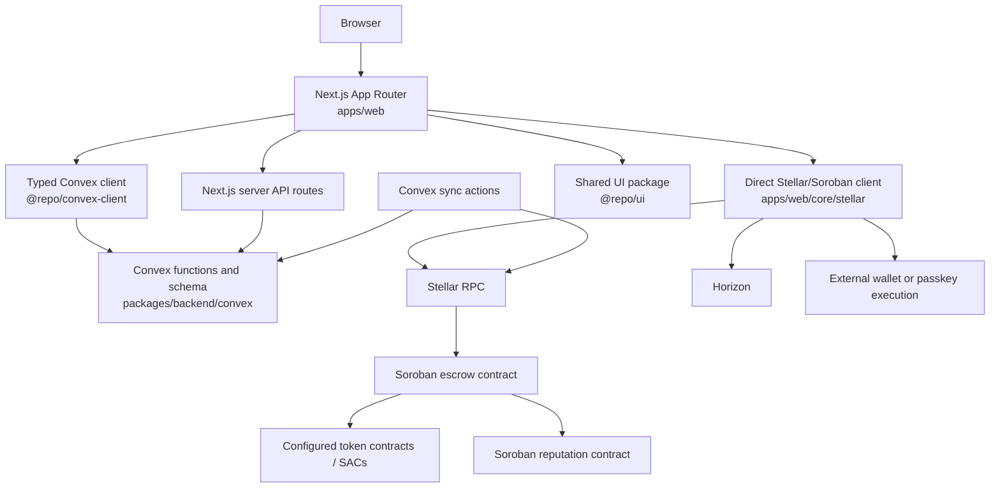

# Architecture Overview

Highrable is a three-layer product with a fourth shared integration surface:

## Responsibilities

- Next.js owns routes, rendering, client state composition, server auth/admin endpoints, SEO, and the user-facing workflow.
- Convex owns fast product state, relationships, workflow timelines, collaboration records, notifications, admin records, and the local mirror of selected chain state.
- Direct Stellar code builds/simulates/submits contract transactions, reads Soroban state, interacts with Horizon for classic account operations, and selects the external-wallet or passkey execution path.
- Soroban escrow owns asset custody, escrow state transitions, authorization, dispute settlement, and the call into reputation on ordinary release.
- Soroban reputation owns immutable completion records and freelancer aggregates.
- `@repo/ui` provides generic primitives plus Highrable-specific visual components; it is not the application state layer.

## Boundaries

The chain is authoritative for escrow funds and Soroban reputation. Convex is authoritative for product workflow state that has no on-chain equivalent, such as proposals, agreement versions, messages, attachments, notifications, and dispute evidence. A Convex mirror can lag or fail; sync metadata and transaction records make that visible.

There is no dedicated historical transaction indexer or general API gateway in this repository. Browser clients normally use the typed Convex client directly, while the Next server API is concentrated around Stellar authentication and admin operations.

See [[Data Flow]], [[Integration Boundaries]], and [[Current System State]].
