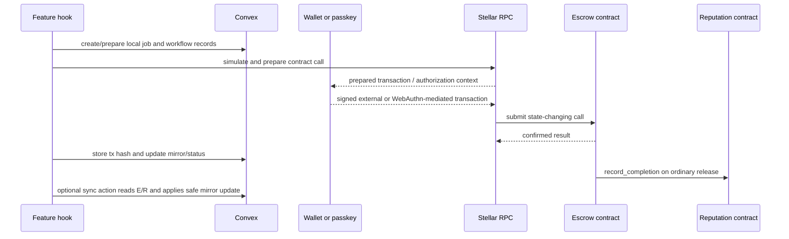

# Data Flow

## Typical escrow flow

The exact order varies by action. For example, `createEscrowRecord` accepts an on-chain escrow ID after the browser call, while `updateEscrowStatus` stores operation-specific transaction hashes and patches job/milestone state. Chain execution and Convex bookkeeping are separate operations; a successful chain transaction does not make a failed Convex mutation disappear.

## Read flow

- Browser contract reads use `simulateContractCall` with a classic source account where RPC requires one.
- Backend sync actions use `packages/backend/convex/lib/stellarReads.ts`, which builds a simulation transaction from `STELLAR_READ_SOURCE_ACCOUNT`.
- The backend normalizes Soroban enum/address/bytes values and then calls internal mutations.

## Dispute flow

Convex stores evidence, participant responses, timeline events, and admin review state. The browser can call `mark_disputed`; the contract moves `Funded` or `Submitted` to `Disputed`. Admin settlement calls `resolve_dispute` on chain, then Convex records the settlement result and patches escrow/job/milestone terminal state.

## What is not automated

There is no all-wallet historical transaction scan, no event-driven indexer, and no cron that continuously reconciles every escrow/reputation record. The only current cron is deadline reminder scanning.

See [[modules/Sync and Transactions]], [[backend/Sync and Scheduled Jobs]], and [[Current System State]].
