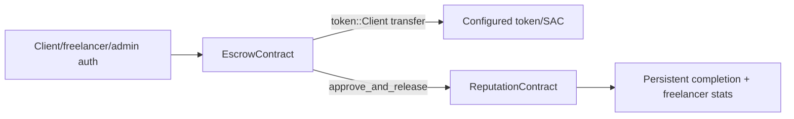

# Soroban Contract Architecture

The Rust workspace in `contracts/Cargo.toml` contains two packages using Soroban SDK `22.0.0`:

- `highrable-escrow`: custody and workflow state for token-backed freelance escrows.
- `highrable-reputation`: immutable completion records and freelancer aggregates.

The escrow contract stores its configuration and counters in instance storage and each `TEscrow` in persistent storage. The reputation contract stores its authorized escrow address in instance storage and completion/stat records in persistent storage. Every public method calls `touch_instance`, extending instance TTL when below the threshold.

The contracts do not emit events in the current source. Off-chain mirror updates therefore use explicit transaction results or action-driven RPC reads rather than a contract-event indexer.

See [[contracts/Escrow Contract]], [[contracts/Reputation Contract]], and [[contracts/Deployment Artifacts]].
