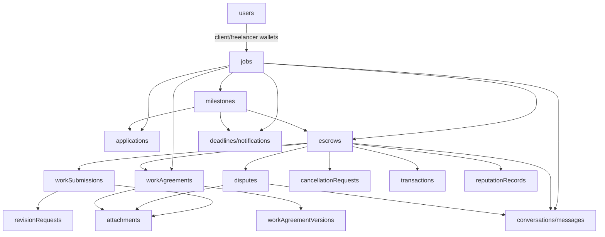

# Domain Data Model

## Core relationships

- A user is identified by a wallet address and optional wallet type; the same human can have distinct external and smart-account addresses.
- A job is the parent for either a micro gig or an ordered milestone project.
- Applications attach a freelancer proposal to a job or milestone.
- An escrow attaches to a job and optionally a milestone; `escrowId` is the on-chain numeric ID serialized as a string in Convex.
- Agreements attach to jobs and optionally milestones/escrows; versions are the immutable content/terms units.
- Work submissions attach to a job/milestone/escrow and can reference an agreement version, revision request, and attachments.
- Disputes/cancellations attach to a parent and optionally an escrow/milestone/agreement; events provide their timelines.
- Conversations are polymorphic parent threads; system messages mirror important workflow events.
- Deadlines are derived from job/milestone parents, while notifications are wallet-recipient records.
- Reputation records attach released escrows back to jobs/milestones and profiles.

## Chain vs product records

| Concern | Convex | Soroban |
| --- | --- | --- |
| Job content and proposals | Authoritative | Not stored |
| Agreement versions and collaboration | Authoritative | Only hashes passed to escrow where relevant |
| Escrow balance/status | Mirror plus UX metadata | Authoritative for escrow funds/status |
| Work proof | Metadata, attachments, proof hash, anchor status | `proof_hash` on escrow after `submit_work` |
| Reputation | Display/sync record | Immutable completion and aggregate stats |
| Dispute evidence/review | Authoritative workflow | Escrow `Disputed`/settlement and fund movement |
| Historical wallet activity | Partial transaction rows | No repository indexer |

## Change guidance

When adding a field, determine whether it belongs to product state, a chain mirror, a transaction audit record, or a state machine. Avoid treating a duplicated field in Convex and Soroban as two independent sources of truth.

Related: [[data/Convex Schema]], [[architecture/Data Flow]], [[modules/Sync and Transactions]].
